## Звіт — 31 серпня 2026

### Загальна інформація

| Поле | Значення |
| --- | --- |
| **Дата** | 31.08.2026 |
| **Автор** | Дмитро Сімко |
| **Проєкт** | Teach UA |
| **Ціль** | Автоматизувати процеси збірки, тестування, перевірки безпеки й розгортання проєкту TeachUA за допомогою декларативного Jenkins пайплайну та Ansible. Розділити компоненти системи на окремі віртуальні машини (фронтенд, бекенд, БД) для підвищення надійності. Оптимізувати використання ресурсів ноутбука шляхом збирання всіх образів за допомогою Jenkins-агента на керуючій ВМ та їх легковагового розгортання на цільовому хості. |
| **Завдання** | 1. Налаштувати автоматизоване розгортання вебзастосунку за допомогою Ansible на 3 окремі віртуальні машини. 2. Організувати балансування навантаження на базі Nginx для забезпечення відмовостійкості сервісів. 3. Спроектувати та реалізувати декларативний CI/CD пайплайн у Jenkins. 4. Впровадити безперервну інспекцію якості коду (CCI) через SonarCloud. 5. Реалізувати автоматичне сканування Docker-образів на вразливості за допомогою Trivy. 6. Розгорнути інструменти моніторингу (Prometheus, Grafana, Node Exporter) на окремій віртуальній машині для контролю працездатності системи. |

### Цілі

**Основна мета:** Побудова зрілого, захищеного та повністю автоматизованого процесу доставки (CI/CD Pipeline) для контейнеризованого додатка TeachUA.

**Супутні цілі:**
- Повний розподіл архітектури додатка на окремі вузли: виділення окремих ВМ під фронтенд, бекенд та базу даних MariaDB за допомогою Ansible.
- **Винесення інфраструктури моніторингу на окрему виділену віртуальну машину для ізоляції телеметрії від продуктового середовища додатка.**
- Повна декларативна автоматизація конфігурації цільових серверів через Ansible Roles, Playbooks, Templates та Handlers.
- Забезпечення високої доступності (High Availability) та правильної маршрутизації трафіку через Nginx Reverse Proxy.
- Автоматична перевірка безпеки коду та Docker-образів прямо під час збирання проєкту, щоб знаходити помилки якомога раніше.
- Оптимізація утилізації ресурсів дискової підсистеми (I/O) хост-машини (ноутбука) через раціональний розподіл DevOps-навантаження між віртуальними машинами.

### Виконані завдання

| # | Завдання | Статус | Відповідальний | Дата завершення | Примітки |
| --- | --- | --- | --- | --- | --- |
| 1 | Implement Automation Setup a Webapp (Ansible) | Завершено | Дмитро Сімко | 31.08.2026 | Створення Ansible-скриптів для конфігурації та деплою на 3 окремі віртуальні машини (Frontend, Backend, Database). |
| 2 | Setup Load Balancing for Webapp | Завершено | Дмитро Сімко | 31.08.2026 | Конфігурація Nginx як Reverse Proxy/Load Balancer (Upstream на Frontend/Backend) з автоматизацією деплою через Ansible. |
| 3 | Implement a Continuous Integration/Continuous Delivery | Завершено | Дмитро Сімко | 31.08.2026 | Розробка та запуск декларативного `Jenkinsfile` для автоматизації всього життєвого циклу збірки. |
| 4 | Implement CCI (Continuous Code Inspection) | Завершено | Дмитро Сімко | 31.08.2026 | Інтеграція кроку аналізу коду в SonarCloud для контролю технічного боргу проекту `dima19-93_Teach_ua`. |
| 5 | Scanning images and dependencies in CI/CD | Завершено | Дмитро Сімко | 31.08.2026 | Впровадження автоматичної перевірки зібраних Docker-образів за допомогою утиліти Trivy. |
| 6 | Set up monitoring tools for application performance and infrastructure health | Завершено | Дмитро Сімко | 31.08.2026 | Автоматизоване розгортання Prometheus та Grafana на окремій віртуальній машині з налаштованим Telegram-алертингом. |

### Результати

**Виконані дії:**
- **Оптимізація та розподіл інфраструктури на віртуальні машини:** За допомогою Ansible Playbook було повністю розділено компоненти проєкту на окремі цільові віртуальні машини: **перша машина** — для фронтенду, **друга машина** — для бекенду, **третя машина** — для бази даних MariaDB, а також **окрема виділена віртуальна машина** — суто під потреби моніторингу та алертингу інфраструктури.
- **Оптимізація архітектури розгортання (Розвантаження диска):** З огляду на обмежені ресурси локального ноутбука, було змінено підхід до збирання артефактів. Усі ресурсомісткі процеси збирання Docker-образів фронтенду та бекенду (`Build Stage`) перенесені виключно на одну керуючу віртуальну машину, де вони виконуються за допомогою Jenkins-агента. На трьох цільових серверах (Target VMs) важкі процеси компіляції повністю виключені — за допомогою Ansible налаштовано лише швидке завантаження готових образів (`docker pull`) з реєстру Docker Hub та їх безпосереднє розгортання на цільову машину, що суттєво знизило навантаження на диск ноутбука.
- **Розробка декларативного CI/CD пайплайну (Jenkins):** Описано автоматизований життєвий цикл у `Jenkinsfile`. Налаштовано етапи завантаження вихідного коду (`Checkout`), збирання продуктових Docker-образів на керуючій ВМ з унікальними тегами (`BUILD_NUMBER`), автоматичну авторизацію через `--password-stdin` та доставку в Docker Hub реєстр.
- **Впровадження Continuous Code Inspection (SonarCloud):** Інтегровано утиліту `sonar-scanner` на ранньому етапі збірки. Налаштовано виключення (`sonar.exclusions`) для сторонніх папок (`node_modules`, `target`, `devops`), щоб прискорити аналіз та фокусуватися виключно на бізнес-логіці проєкту.
- **Автоматизація DevSecOps (Trivy Scanning):** Реалізовано стейдж `Trivy Security Scanning`, який сканує зібрані Docker-образи фронтенду та бекенду на керуючій машині. Налаштовано фільтрацію за рівнем загрози (`HIGH,CRITICAL`), що дозволяє оперативно виявляти CVE у базових пакетах системного оточення перед відправкою образів у Docker Hub.
- **Маршрутизація та балансування навантаження (Nginx):** Конфігуровано балансувальник навантаження через Ansible Jinja2 шаблон `nginx.conf.j2`. Створено блок `upstream backend` на порт `8080` відповідної ВМ бекенду, налаштовано проксіювання всього вхідного трафіку на ВМ фронтенду (порт `3000`) із підтримкою WebSocket протоколу (`Upgrade`, `Connection`), а API-запитів — на ВМ бекенду за шляхом `/dev/`.
- **Конфігурація та деплой за допомогою Ansible:** Налаштовано етап попередньої валідації синтаксису плейбуків (`Ansible Lint & Syntax Check`). Реалізовано стейдж безпечного деплою (`Ansible Deploy`) з автоматичним прокиданням SSH-ключів, паролів доступу (`become`), Docker Hub облікових даних та змінних оточення безпосередньо всередині раннера Jenkins із наступним повним очищенням робочого простору (`cleanWs`).
- **Моніторинг та спостережуваність (Observability) на виділеній ВМ:** Розгорнуто моніторингову інфраструктуру в ізольованій мережі Docker (`monitoring_network`) безпосередньо на окремій віртуальній машині. Автоматизовано розгортання контейнера Prometheus v2.45.0 із динамічним конфігуруванням через Ansible-шаблони, а також системи візуалізації Grafana v10.0.0. Налаштовано автоматичний імпорт джерел даних (Data Sources Provisioning) за допомогою файлу `grafana_datasources.yml`. На цільовому хості розгорнуто Node Exporter для збору системних метрик (утилізація CPU, RAM, дисків, мережі). Додатково впроваджено параметри `GF_CONTACT_POINTS_TELEGRAM` для автоматизації доставки алертів у Telegram-чат.

**Досягнуті результати:**

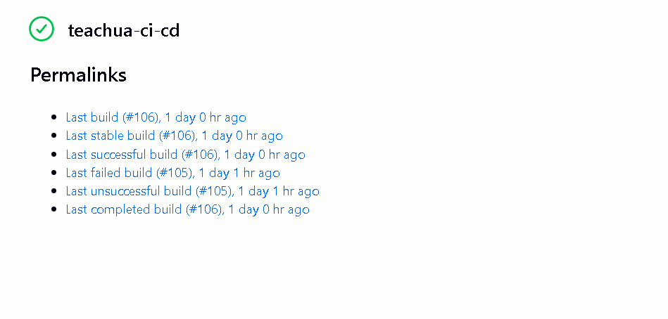
*Декларативний пайплайн Jenkins: успішне виконання всіх етапів автоматизації та безпеки*

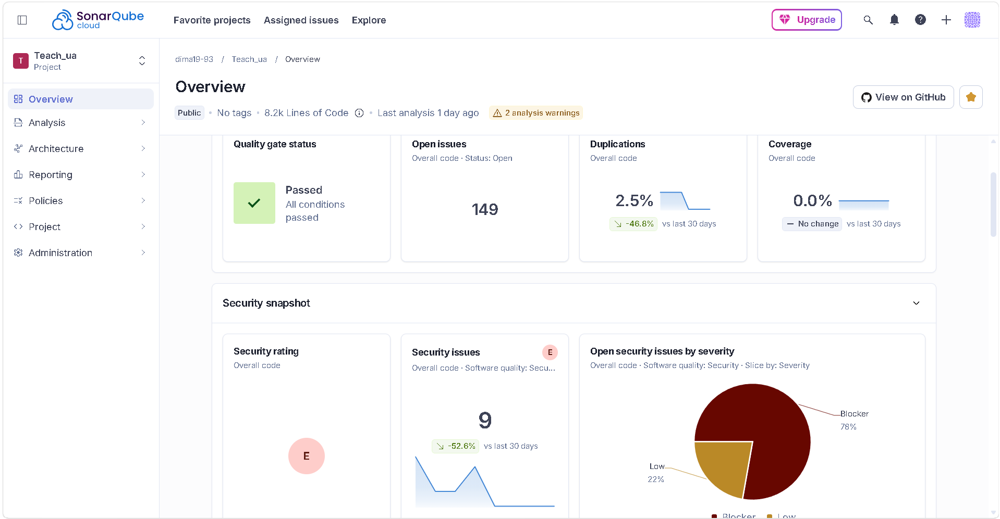
*Початковий статичний аналіз у SonarCloud: базова перевірка коду проєкту TeachUA*

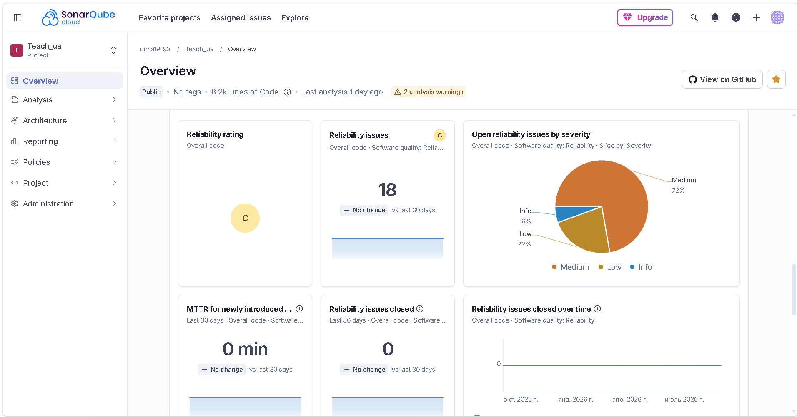
*Актуальний аналіз у SonarQube Cloud: загальний огляд (Overview) метрик надійності, технічного боргу та розподілу виявлених зауважень за рівнем загрози (Severity)*

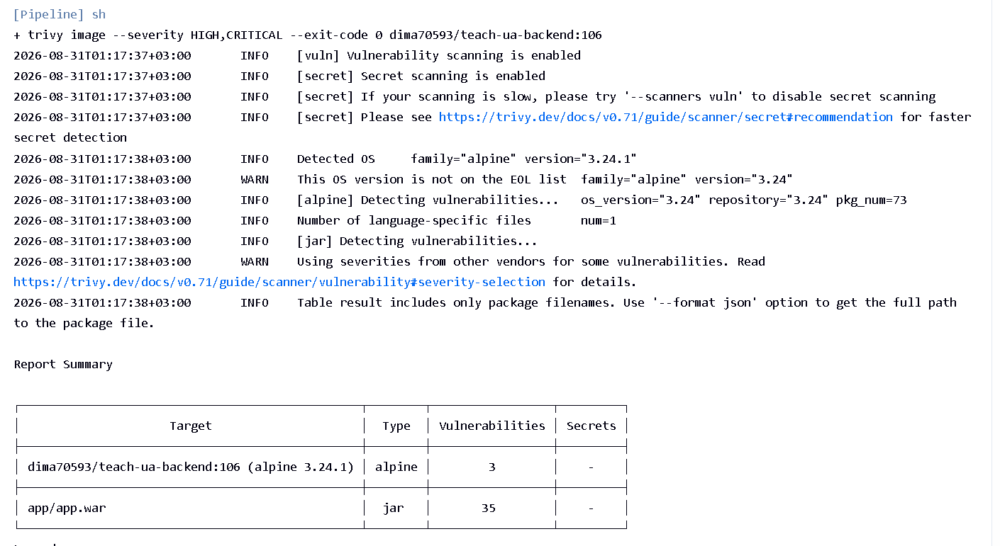
*Консольний вивід Trivy: успішне сканування образів на вразливості категорій HIGH та CRITICAL*

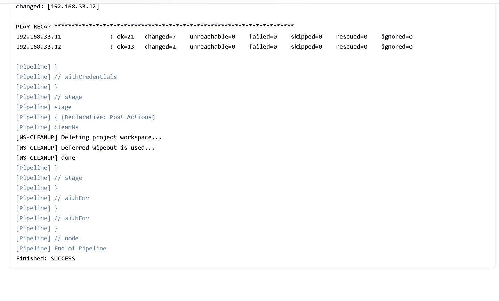
*Консоль Jenkins: фінальний блок PLAY RECAP виконання плейбука Ansible та статус Finished: SUCCESS*

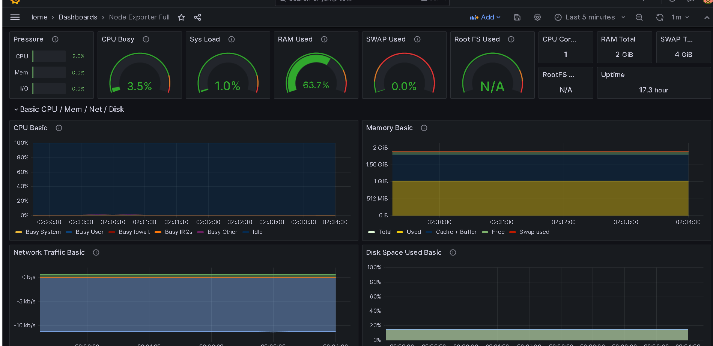
*Дашборд моніторингу Grafana: базове відображення системних метрик*

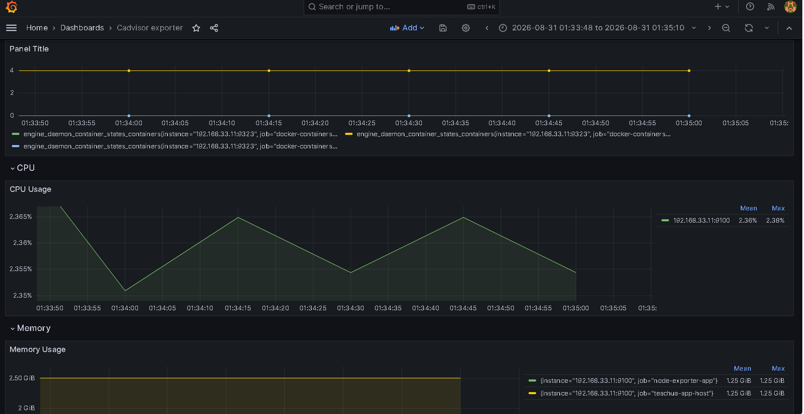
*Дашборд моніторингу Grafana (cAdvisor exporter): актуальне відображення споживання ресурсів (CPU, Memory) конкретними Docker-контейнерами проєкту TeachUA на цільовій віртуальній машині*

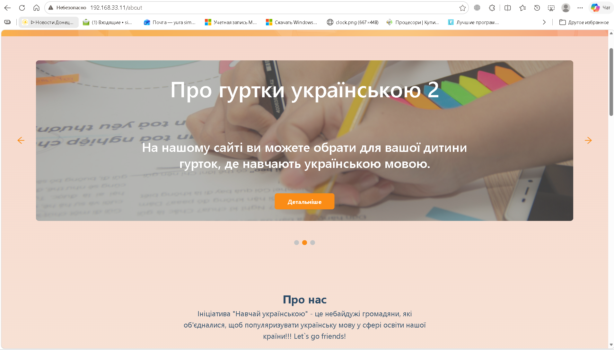
*Верифікація деплою: відображення унікальної фрази «let's go friends» на UI сайту*

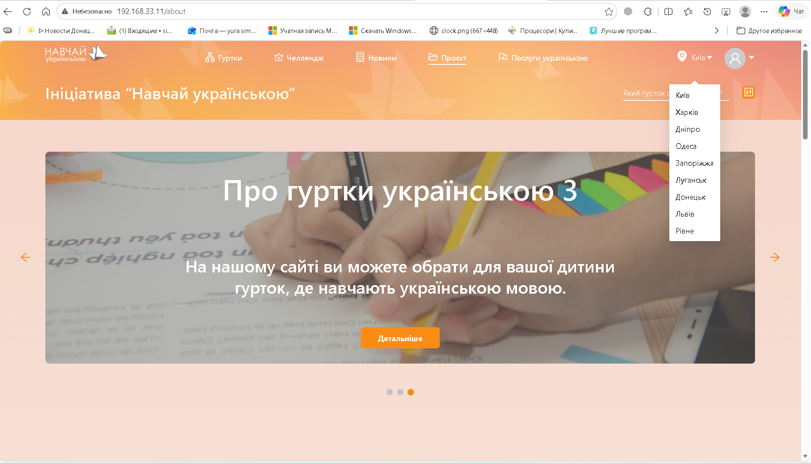
*Верифікація інтеграції з базою даних: успішне динамічне вичитування та відображення повного списку міст із MariaDB на інтерфейсі застосунку*

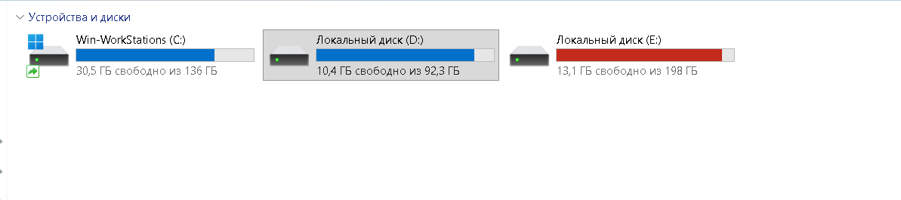
*Апаратні обмеження локального диска хост-машини, що зумовили винесення етапу docker pull на 1 цільову ВМ*

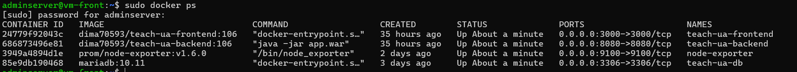
*Розподілена інфраструктура: запущені контейнери додатків на окремій віртуальній машині за допомогою Ansible*

- **Ізольований моніторинг:** Налаштування Prometheus та Grafana на окремій віртуальній машині гарантує, що моніторингове навантаження та збереження часових метрик жодним чином не впливають на стабільність і ресурси продуктового сервера вебзастосунку TeachUA.
- **Підвищення безпеки артефактів:** Завдяки зв'язці SonarCloud + Trivy, код додатка та инраструктурні Docker-контейнери проходять подвійний аудит безпеки перед релізом.
- **Контроль та швидке реагування:** Створена система моніторингу (Prometheus + Grafana) надає повну видимість ресурсів віртуальних машин, а інтегрований Telegram-алертс-бот миттєво інформує про критичні показники заліза або падіння сервісів.

### Проблеми та рішення

| # | Проблема | Рішення | Статус |
| --- | --- | --- | --- |
| 1 | Ризик витоку конфіденційних даних (токенів, паролів `sudo`, секретних змінних) у логах пайплайну Jenkins | Використано плагін `withCredentials`, що дозволило безпечно інтегрувати токени (`SONAR_TOKEN`, `TG_TOKEN`) та паролі у вигляді ефемерних змінних оточення | Завершено |
| 2 | Помилки автентифікації на етапі відправки образів до Docker Hub всередині автоматичного раннера | Реалізовано передачу пароля через стандартний потік вводу (`docker login -u ... --password-stdin`), що виключає відображення та логування пароля в системних процесах | Завершено |
| 3 | Падіння збірки через конфлікт залишків файлів group_vars від попередніх запусків пайплайну | Організовано блок `post { always { cleanWs() } }`, який гарантовано очищує робочий простір раннера та видаляє копії тимчасових секретів | Завершено |
| 4 | Необхідність проактивного сповіщення команди про критичний стан інфраструктури без постійного моніторингу дашбордів | У конфігурацію контейнера Grafana через Ansible змінні впроваджено параметри зв'язку з Telegram API (`GF_CONTACT_POINTS_TELEGRAM_CHAT_ID`), що дозволило автоматизувати доставку алертів у Telegram-чат | Завершено |
| 5 | Високе дискове та процесорне навантаження на локальний ноутбук при спробах паралельної компіляції та деплою сервісів | Архітектурно розділено середовища: важкий етап збирання (`docker build`) для фронтенду та бекенду локалізовано виключно на керуючій ВМ за допомогою Jenkins-агента, а на 1 цільовій ВМ застосовано легковагову стратегію `docker pull` готових образів для їх подальшого розгортання | Завершено | 

### Наступні кроки

- ** Міграція вебзастосунку в хмару (Cloud Migration):** Перенесення інфраструктури проєкту **TeachUA** з локальних віртуальних машин у хмарне середовище (Cloud Environment) для покращення масштабованості, гнучкості та забезпечення високої доступності.
- ** Налаштування централізованого збору та аналізу логів у Splunk:** Інтеграція платформи **Splunk** у поточний пайплайн та інфраструктуру для агрегації, глибокого аналізу системних логів та швидкого дебагу помилок додатків.

### Додатки та ресурси

- **Репозиторій проєкту:** [dima19-93/Teach_ua](https://github.com/dima19-93/Teach_ua)
- **Документація Jenkins (Declarative Pipeline):** https://www.jenkins.io/doc/book/pipeline/syntax/
- **Документація Ansible (Roles & Templates):** https://docs.ansible.com/ansible/latest/playbook_guide/playbooks_reuse_roles.html, https://docs.ansible.com/ansible/latest/playbook_guide/playbooks_templating.html
- **Документація Prometheus & Grafana (Provisioning):** https://prometheus.io/docs/introduction/overview/, https://grafana.com/docs/grafana/latest/administration/provisioning/, https://grafana.com/docs/grafana/latest/alerting/fundamentals/

# Звіт — 14 серпня 2026

## DevOps Звіт

### Загальна інформація

| Поле | Значення |
| :--- | :--- |
| **Дата** | 14.08.2026 |
| **Автор** | Дмитро Сімко |
| **Проєкт** | Teach UA |
| **Ціль** | Дослідити процеси контейнеризації, реалізувати концепцію «Інфраструктура як код» (IaC) для автоматизованого керування віртуальним середовищем, а також налаштувати стабільне локальне середовище та процес розгортання вебзастосунку з усуненням помилок доступу. |
| **Завдання** | • Налаштувати локальне середовище та процес розгортання для вебзастосунку; • Підготувати інфраструктуру як код (IaC) для автоматизованого керування ресурсами; • Дослідити процеси контейнеризації та розгортання вебдодатку. |

### Цілі

**Основна мета:** Розгортання інфраструктури та автоматизація середовища для контейнеризованого веб-додатку.

**Супутні цілі:**
- Впровадження підходу Infrastructure as Code (IaC) за допомогою Vagrant для керування ресурсами ОС.
- Підготовка середовища для стабільної роботи контейнеризованого додатка.

### Виконані завдання

| # | Завдання | Статус | Відповідальний | Дата завершення | Примітки |
| :-: | :--- | :-: | :--- | :-: | :--- |
| **1** | Setup a Webapp | Завершено | Дмитро Сімко | 14.08.2026 | Локальне налаштування та конфігурація веб-додатку |
| **2** | Implement Infrastructure as Code | Завершено | Дмитро Сімко | 14.08.2026 | Опис та розгортання інфраструктури за допомогою коду (Vagrant) |
| **3** | Deploying a Containerized Web Application | Завершено | Дмитро Сімко | 14.08.2026 | Опис та автоматизація запуску контейнерної архітектури у docker-compose.yml.|

### Результати

**Виконані дії:**
- **Локальне розгортання вебдодатку:** Налаштовано та запущено ізольоване середовище розробки за допомогою Vagrant. Описано конфігурацію віртуальної машини (виділення CPU/RAM, мережеві налаштування) у Vagrantfile.
- **Контейнеризація сервісів (Docker Compose):** Розроблено `docker-compose.yaml` для трьох основних сервісів проєкту TeachUA, що дозволило повністю відмовитися від ручного створення контейнерів:
  - **MariaDB 10.11:** налаштовано збереження даних через іменований том `mariadb_data` та автоматичний імпорт початкового дампу бази з `init-db/data.sql` у режимі *read-only*.
  - **Backend (Java):** прописано підключення до БД через JDBC-драйвер; налаштовано залежність `depends_on` після успішного проходження healthcheck базою даних (`service_healthy`).
  - **Frontend (React):** налаштовано збірку застосунку з передачею аргументу `REACT_APP_ROOT_SERVER`, який використовує системну змінну `${VAGRANT_IP}` для автоматичного підключення фронтенду до бекенда.

### Досягнуті результати
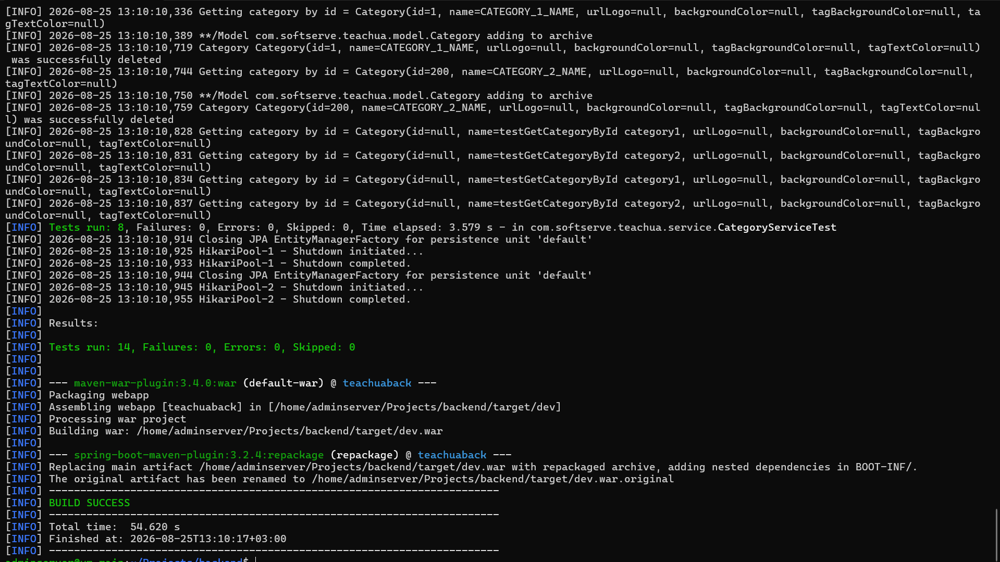  
*Maven Build: успішна збірка проекту та проходження тестів (BUILD SUCCESS)*

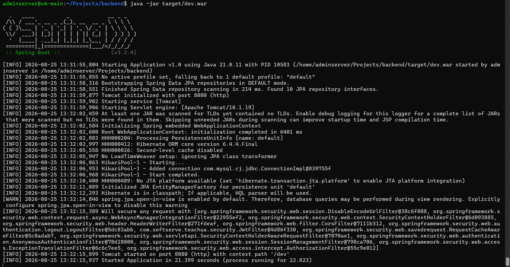  
*Backend Start: успішний запуск Spring Boot додатка на порту 8080 (context path '/dev')*

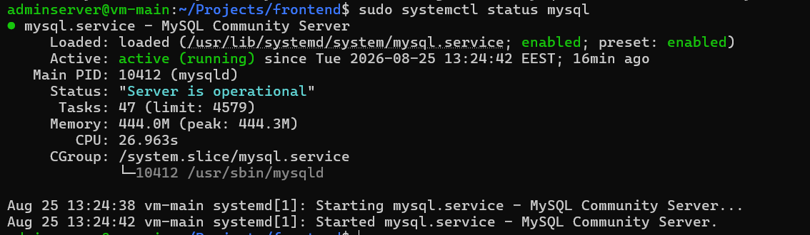  
*MySQL Status: перевірка працездатності СУБД MySQL Community Server (Active: active (running))*

  
*Vagrant SSH: підготовлене віртуальне середовище*

  
*Frontend: сторінка TeachUA (головна сторінка та вибір міста)*

  
*Docker ps: запущені контейнери TeachUA*

  
*Frontend: сторінка TeachUA*

  
*Backend API: успішний запит до ендпоінту /dev/api/cities (отримання списку міст у форматі JSON)*

  
*Docker logs: teachua-backend (успішні запити та cities)*

  
*Frontend: головна сторінка веб-додатка TeachUA (візуалізація списку міст, отриманих з БД)*

- Створено та успішно підготовлено базову операційну систему у віртуальному середовищі з автоматично розгорнутим середовищем виконання контейнерів.
- Запуск всієї архітектури додатку тепер повністю автоматизовано та здійснюється однією командою docker compose up -d.
- Зв’язок між Backend та Database: за логами контейнера **teachua-backend** підтверджено успішну взаємодію між сервісами. Додаток без помилок підключається до MariaDB та динамічно вичитує дані (наприклад, структуровані списки міст із гео-координатами), що доводить коректність ініціалізації схеми БД.
- Реалізовано правильний порядок старту сервісів проєкту **TeachUA**: бекенд не починає завантажуватися, доки MariaDB повністю не підніметься та не пройде внутрішню перевірку працездатності, що усуває помилки підключення до БД при старті.
- Код/конфігурації DevOps: [Teach_ua/devops at main · dima19-93/Teach_ua](https://github.com)
- Забезпечено збереження даних (data persistence): навіть при перезапуску чи видаленні контейнерів інформация в базі даних не втрачається завдяки Docker Volumes.

### Проблеми та рішення

| # | Проблема | Рішення | Статус |
| :-: | :--- | :--- | :-: |
| **1** | Неможливість підключення бекенду до бази даних MariaDB при докеризації сервісів | Організовано спільну віртуальну мережу (Docker Network) в межах Docker Compose та узгоджено хости підключення | Завершено |
| **2** | Помилка конфлікту портів при локальному розгортанні кількох сервісів одночасно | Перепризначено зовнішні порти у файлі docker-compose.yml (наприклад, змінено стандартні порти на вільні) | Завершено |
| **3** | Виявлення утилізації секретів (*Public leak*) — захардкожений Google API Key у коді фронтенду та випадковий пуш файлу `.env` на GitHub. | Код змінено на використання змінної `process.env`. Секретні дані винесено в локальний файл **`.env`**, а в `docker-compose.yml` залишено лише посилання на змінні оточення. У головний `.gitignore` додано глобальну маску `.env*`, а історію Git повністю очищено через `force push`. | Завершено |

### Наступні кроки

- **Масштабування інфраструктури на 3 віртуальні машини:** налаштування Ansible (playbook) для підняття трьох окремих ВМ, щоб повністю розділити компоненти проєкту: перша машина — для фронтенду, друга — для бекенду, третя — для бази даних MariaDB.
- **Налаштування балансування навантаження (Load Balancing):** розгортання та конфігурація балансувальника навантаження (наприклад, Nginx або HAProxy) перед контейнерами фронтенду та бекенду для оптимізації розподілу трафіку та забезпечення відмовостійкості системи.
- Впровадження процесів CI/CD (Continuous Integration / Continuous Delivery): проєктування та побудова автоматизованого пайплайну (наприклад, через GitHub Actions, GitLab CI або Jenkins) для автоматичної збірки Docker-образів, проходження лінтерів, тестування коду та безперервної доставки оновлень на цільовий сервер.

### Використані інструменти та технології

- **Docker:** Використаний для контейнеризації компонентів вебзастосунку. Забезпечує повну ізоляцію середовища виконання, гарантує ідентичність роботи сервісів (Frontend, Backend, MariaDB).
- **Docker Compose:** як інструмент для опису всієї локальної інфраструктури (Frontend, Backend, DB) в одному файлі `docker-compose.yml` та її запуску однією командою.
- **Vagrant:** Використаний для автоматизації створення, конфігурації та керування віртуалізованим робочим середовищем ОС (Infrastructure as Code).
- **Oracle VM VirtualBox:** Використаний як гіпервізор (середовище віртуалізації) для апаратної ізоляції та запуску гостьових операційних систем на локальній машині.
- **MariaDB:** Реляційна база даних, яка розгорталася в окремому контейнері.
- **Git / GitHub:** Система контролю версій, яка використовувалася для збереження коду, фіксації змін при виправленні помилок та синхронізації завдань.
- **Java & Spring Boot:** Технологічний стек бекенд-частини застосунку.
- **Maven:** Інструмент автоматизації збирання та менеджменту залежностей Java-додатка.
- **Node.js (v18):** Застосований як середовище виконання JavaScript на етапі збирання фронтенд-частини застосунку.

### Коментарі та висновки

У ході виконання роботи було успішно реалізовано повний цикл розгортання багатокомпонентного вебзастосунку за допомогою сучасних DevOps-практик. Завдяки зв'язці **VirtualBox + Vagrant** створено повністю ізольоване та відтворюване середовище ОС.

Впровадження **Docker** та **Docker Compose** дозволило повністю автоматизувати життєвий цикл контейнерів, описати інфраструктуру сервісів як код (IaC), налаштувати автоматичне збирання компонентів, а також організувати захищену внутрішню мережу для взаємодії сервісів із базою даних MariaDB без необхідності ручного втручання в запуск кожного окремого контейнера.

Усі критичні помилки архітектурного рівня (блокування мережі, конфлікти портів, CORS та помилки авторизації HTTP 403) були успішно локалізовані та усунені.

### Додатки та ресурси

- Репозиторій проєкту: [dima19-93/Teach_ua](https://github.com)
- Документація Vagrant: [https://hashicorp.com](https://hashicorp.com)
- Документація Docker (Networks у Docker Compose): [https://docker.com](https://docker.com)
- Документація Node.js v18: [https://nodejs.org](https://nodejs.org)
- Документація Maven: [https://apache.org](https://apache.org)
- Документація MariaDB: [https://mariadb.com](https://mariadb.com)

