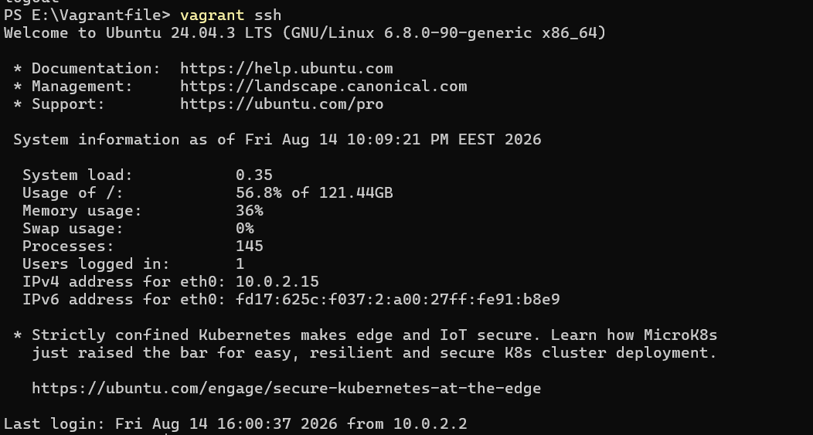
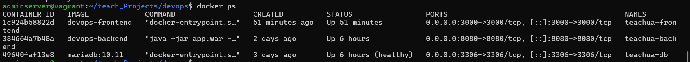
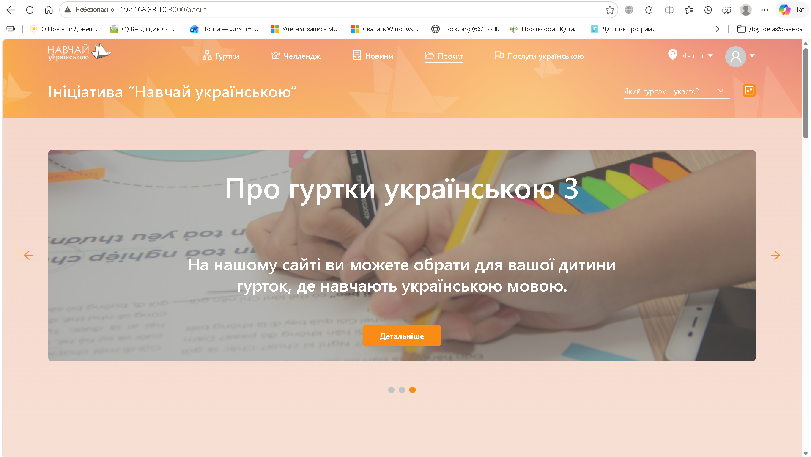
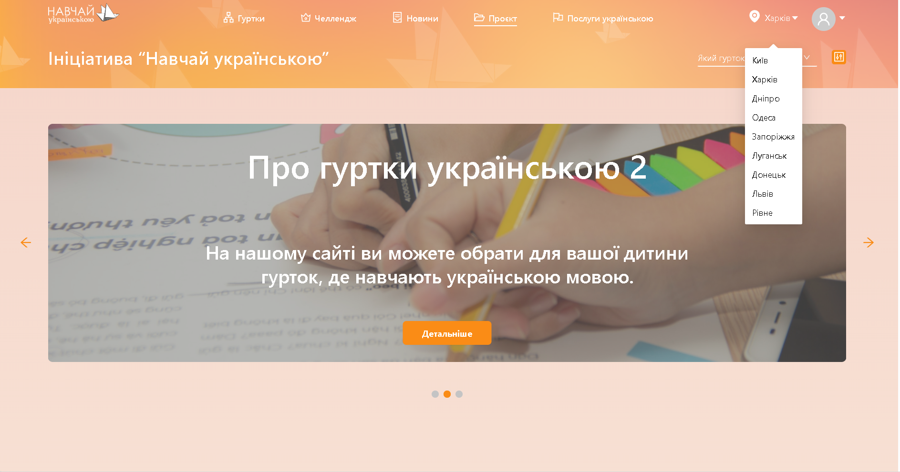
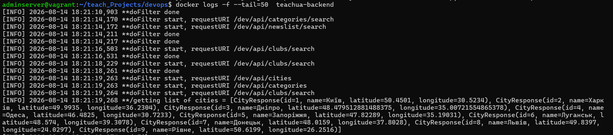
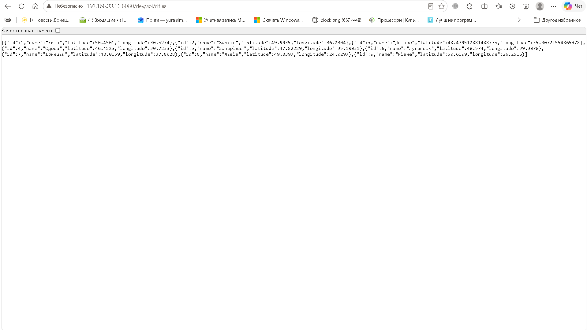

# Звіт — 14 серпня 2026

## DevOps Звіт

### Загальна інформація

| Поле | Значення |
| :--- | :--- |
| **Дата** | 14.08.2026 |
| **Автор** | Дмитро Сімко |
| **Проєкт** | Teach UA |
| **Ціль** | Дослідити процеси контейнеризації, реалізувати концепцію «Інфраструктура як код» (IaC) для автоматизованого керування ресурсами, а також налаштувати стабільне локальне середовище та процес розгортання вебзастосунку з усуненням помилок доступу. |
| **Завдання** | • Налаштувати локальне середовище та процес розгортання для вебзастосунку; • Підготувати інфраструктуру як код (IaC) для автоматизованого керування ресурсами; • Дослідити процеси контейнеризації та розгортання вебдодатку. |

### Цілі

**Основна мета:** Розгортання та автоматизація інфраструктури для контейнеризованого веб-додатку.

**Супутні цілі:**
- Впровадження підходу Infrastructure as Code (IaC) для керування ресурсами.
- Підготовка середовища для стабільної роботи контейнеризованого додатка.

### Виконані завдання

| # | Завдання | Статус | Відповідальний | Дата завершення | Примітки |
| :-: | :--- | :-: | :--- | :-: | :--- |
| **1** | Setup a Webapp | Завершено | Дмитро Сімко | 14.08.2026 | Локальне налаштування та конфігурація веб-додатку |
| **2** | Implement Infrastructure as Code | Завершено | Дмитро Сімко | 14.08.2026 | Опис та розгортання інфраструктури за допомогою коду (Vagrant) |
| **3** | Deploying a Containerized Web Application | Завершено | Дмитро Сімко | 14.08.2026 | Опис та розгортання контейнерної архітектури у docker-compose.yml. |

### Результати

**Виконані дії:**
- **Локальне розгортання вебдодатку:** Налаштовано та запущено ізольоване середовище розробки за допомогою Vagrant. Описано конфігурацію віртуальної машини (виділення CPU/RAM, мережеві налаштування) у Vagrantfile.
- **Контейнеризація сервісів (Docker Compose):** Розроблено `docker-compose.yaml` для трьох основних сервісів проєкту TeachUA:
  - **MariaDB 10.11:** налаштовано збереження даних через іменований том `mariadb_data` та автоматичний імпорт початкового дампу бази з `init-db/data.sql` у режимі *read-only*.
  - **Backend (Java):** прописано підключення до БД через JDBC-драйвер; налаштовано `depends_on` після успішного проходження healthcheck базою даних (`service_healthy`).
  - **Frontend (React):** налаштовано збірку застосунку з передачею аргументу `REACT_APP_ROOT_SERVER`, який використовує системну змінну `${VAGRANT_IP}` для автоматичного підключення фронтенду до бекенда.

### Досягнуті результати

  
*Vagrant SSH: підготовлене віртуальне середовище*

  
*Docker ps: запущені контейнери TeachUA*

  
*Frontend: сторінка TeachUA*

  
*Backend API: /dev/api/cities*

  
*Docker logs: teachua-backend (успішні запити та cities)*

  
*Frontend: вибір міста (дані з API/БД)*

- Створено та успішно підготовлено базову операційну систему у віртуальному середовищі з розгорнутим середовищем виконання контейнерів.
- Зв’язок між Backend та Database: за логами контейнера **teachua-backend** підтверджено успішну взаємодію між сервісами. Додаток без помилок підключається до MariaDB та динамічно вичитує дані (наприклад, структуровані списки міст із гео-координатами), що доводить коректність ініціалізації схеми БД.
- Реалізовано правильний порядок старту сервісів проєкту **TeachUA**: бекенд не починає завантажуватися, доки MariaDB повністю не підніметься та не пройде внутрішню перевірку працездатності, що усуває помилки підключення до БД при старті.
- Код/конфігурації DevOps: [Teach_ua/devops at main · dima19-93/Teach_ua](https://github.com)
- Забезпечено збереження даних (data persistence): навіть при перезапуску чи видаленні контейнерів інформация в базі даних не втрачається завдяки Docker Volumes.

### Проблеми та рішення

| # | Проблема | Рішення | Статус |
| :-: | :--- | :--- | :-: |
| **1** | Неможливість підключення бекенду до бази даних MariaDB при докеризації сервісів | Організовано спільну віртуальну мережу (Docker Network) та узгоджено хости підключення | Завершено |
| **2** | Помилка конфлікту портів при локальному розгортанні кількох сервісів одночасно | Перепризначено зовнішні порти у файлі docker-compose.yml (наприклад, змінено стандартні порти на вільні) | Завершено |
| **3** | Виявлення утилізації секретів (*Public leak*) — захардкожений Google API Key у коді фронтенду та випадковий пуш файлу `.env` на GitHub. | Код змінено на використання змінної `process.env`. Секретні дані винесено в локальний файл **`.env`**, а в `docker-compose.yml` залишено лише посилання на змінні оточення. У головний `.gitignore` додано глобальну маску `.env*`, а історію Git повністю очищено через `force push`. | Завершено |

### Наступні кроки

- **Масштабування інфраструктури на 3 віртуальні машини:** налаштування Ansible (playbook) для підняття трьох окремих ВМ, щоб повністю розділити компоненти проєкту: перша машина — для фронтенду, друга — для бекенду, третя — для бази даних MariaDB.
- **Налаштування балансування навантаження (Load Balancing):** розгортання та конфігурація балансувальника навантаження (наприклад, Nginx або HAProxy) перед контейнерами фронтенду та бекенду для оптимізації розподілу трафіку та забезпечення відмовостійкості системи.
- **Впровадження процесів CI/CD (Continuous Integration / Continuous Delivery):** проєктування та побудова автоматизованого пайплайну (наприклад, через GitHub Actions, GitLab CI або Jenkins) для автоматичної збірки Docker-образів, проходження лінтерів, тестування коду та безперервної доставки оновлень на цільовий сервер.

### Використані інструменти та технології

- **Docker:** Використаний для контейнеризації компонентів вебзастосунку. Забезпечує повну ізоляцію середовища виконання, гарантує ідентичність роботи сервісів (Frontend, Backend, MariaDB) як на локальних машинах розробників, так і на віддалених серверах, а також вирішує проблеми сумісності залежностей.
- **Docker Compose:** як IaC-інструмент для опису всієї локальної інфраструктури (Frontend, Backend, DB) в одному файлі `docker-compose.yml` та її запуску однією командою.
- **Vagrant:** Використаний для автоматизації створення, конфігурації та керування віртуалізованим робочим середовищем. Він забезпечив розгортання ізольованої віртуальної машини з чітко визначеними параметрами ОС та ресурсів.
- **Oracle VM VirtualBox:** Використаний як гіпервізор (середовище віртуалізації) для апаратної ізоляції та запуску гостьових операційних систем на локальній машині.
- **MariaDB:** Реляційна база даних, яка розгорталася в окремому контейнері. Використовувалася для збереження даних проєкту та налаштовувалася для коректної мережевої взаємодії з бекендом.
- **Git / GitHub:** Система контролю версій, яка використовувалася для збереження коду, фіксації змін при виправленні помилок та синхронізації завдань.
- **Java & Spring Boot:** Технологічний стек бекенд-частини застосунку. Використовувався для створення REST API, роботи з базою даних та налаштування безпеки (Spring Security).
- **Maven:** Використаний як автоматизований інструмент для збирання, менеджменту залежностей та керування життєвим циклом бекенд-додатка на Java (Spring Boot). Забезпечив компіляцію вихідного коду, проходження юніт-тестів та пакування додатка у готовий до деплою виконуваний `.jar` файл.
- **Node.js (v18):** Застосований як середовище виконання JavaScript на етапі збирання фронтенд-частини застосунку.

### Коментарі та висновки

У ході виконання роботи було успішно реалізовано повний цикл локального розгортання багатокомпонентного вебзастосунку за допомогою сучасних DevOps-практик. Завдяки зв'язці **VirtualBox + Vagrant** створено повністю ізольоване та відтворюване середовище, що усувает проблему «працює лише на моїй машині».

Впровадження **Docker** та **Docker Compose** дозволило описати інфраструктуру як код (IaC), автоматизувати збирання фронтенду (Node.js 18) та бекенду (Maven/Java), а также організувати захищену внутрішню мережу для взаємодії сервісів із базою даних MariaDB.

Усі критичні помилки архітектурного рівня (блокування мережі, конфлікти портів, CORS та помилки авторизації HTTP 403) були успішно локалізовані та усунені.

### Додатки та ресурси

- Репозиторій проєкту: [dima19-93/Teach_ua](https://github.com)
- Документація Vagrant: [https://hashicorp.com](https://hashicorp.com)
- Документація Docker (Networks у Docker Compose): [https://docker.com](https://docker.com)
- Документація Node.js v18: [https://nodejs.org](https://nodejs.org)
- Документація Maven: [https://apache.org](https://apache.org)
- Документація MariaDB: [https://mariadb.com](https://mariadb.com)

