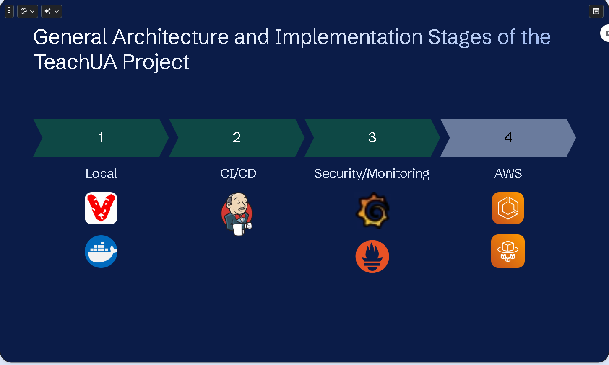
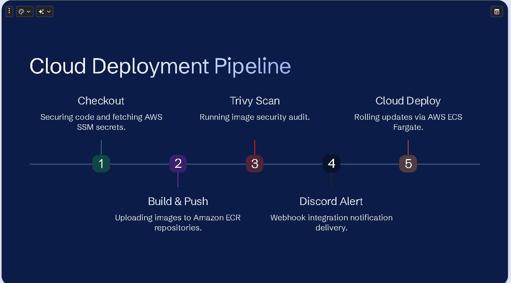
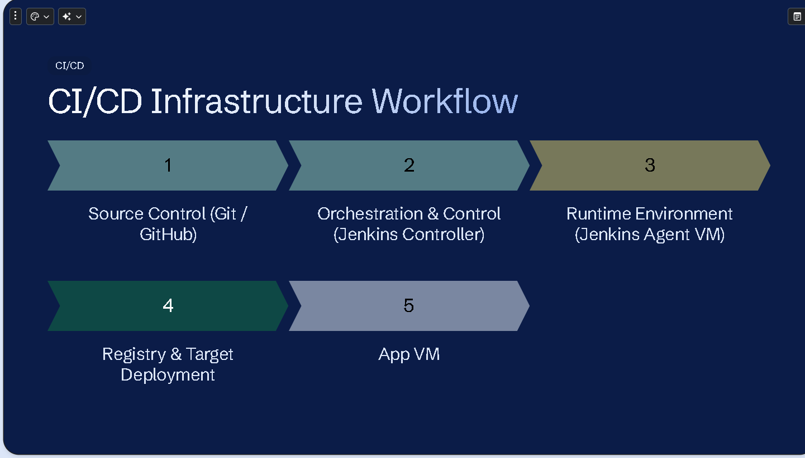
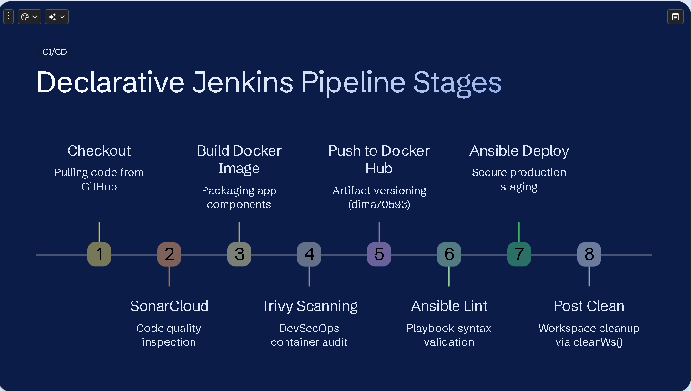
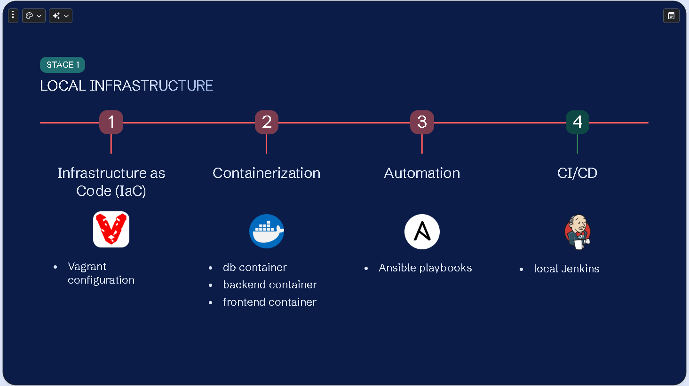

# 🚀 Graduation DevOps Project | Teach_ua

A comprehensive DevOps project focused on automating infrastructure provisioning, continuous integration, continuous delivery (CI/CD), and microservices deployment within a secure and scalable cloud ecosystem.

---

## 🏗️ Cloud Infrastructure & Architecture

The production environment is hosted on **AWS** utilizing managed services for high availability and scalability. The infrastructure is fully provisioned as code (IaC) using **Terraform**.

### General Architecture Diagram
This diagram illustrates the complete cloud topology, including networking (VPC, Subnets), security groups, and microservices management.

### Cloud Deployment Pipeline
Detailed view of how microservices communicate and how the cloud resources are orchestrated within the AWS environment.

---

## 🛠️ Tech Stack & DevOps Tools

*   **Cloud Provider:** AWS (EC2, VPC, IAM, S3, EKS)
*   **Containerization & Orchestration:** Docker, Kubernetes (AWS EKS)
*   **Infrastructure as Code (IaC):** Terraform
*   **CI/CD Automation:** Jenkins / GitHub Actions / GitLab CI
*   **Configuration Management:** Ansible
*   **Monitoring & Observability:** Prometheus & Grafana

---

## 🔄 CI/CD Workflow & Automation

We implemented fully automated CI/CD pipelines to ensure rapid, reliable, and continuous delivery of microservices.

### Production CI/CD Pipeline
Automated pipeline handling code analysis, Docker image building, pushing to a container registry, and rolling deployments to the AWS EKS cluster.

---

## 💻 Local Environment & Development Testing

Before deploying to the cloud, the entire infrastructure and core application workflows were thoroughly tested and validated locally.

### Local Infrastructure Pipeline
Shows the local delivery cycle, integration testing, and local automation steps.

### Local Microservices Deployment
Validating container communication, configuration management, and initial application behavior via local orchestrators / Docker Compose.

---

## 📈 Key Outcomes & Skills Demonstrated
*   **Infrastructure as Code:** 100% automated infrastructure setup using reusable Terraform modules.
*   **Production Kubernetes:** Real-world experience with managed cloud clusters (AWS EKS), namespaces, and deployment scaling.
*   **Robust Observability:** Configured metrics tracking and alerting for proactive infrastructure monitoring.
*   **Secure Delivery:** Integrated security scanning into deployment pipelines to align with DevSecOps best practices.

